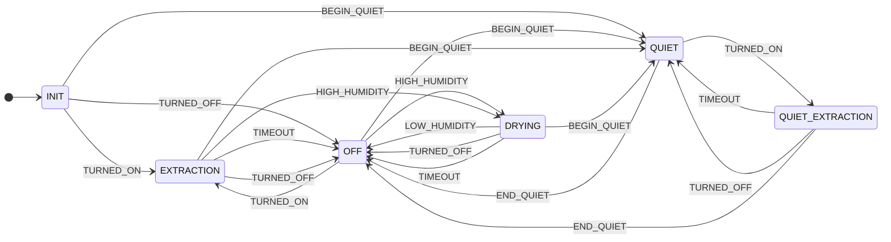

# Shower Fan for AppDaemon

Automates extraction fan for shower/bathrooms to reduce humidity. 

Features:

- Configurable timeout for manually switched on fan
- Automatic extraction based on hubidity
- Quite period (to avoid fan turning on automatically at night)

## Arguments


## Example

```yaml
master_bathroom_fan:
  module: shower_fan
  class: ShowerFan
  reference_humidity_sensor: sensor.living_room_humidity
  humidity_sensor: sensor.master_bathroom_climate_humidity
  humidity_relative_high: 30
  humidity_relative_low: 10
  quiet_time:
    from: "21:00:00"
    to: "07:00:00"
  quiet_switch: switch.quiet_time
  fan: fan.master_bathroom_fan
  fan_off_delay_minutes: 10
  log_level: INFO
```

## State Machine

